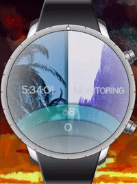
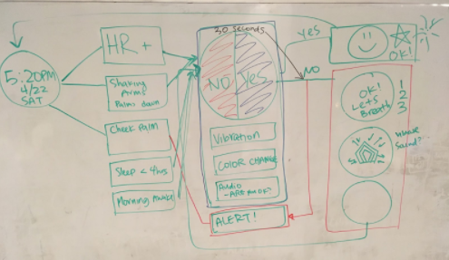

# 
# Bendo

### Purpose of Device

Self Injurious Behaviors (SIBs) are a major concern and problem for need-knowers who have Smith–Magenis syndrome (SMS). SMS need-knowers are afflicted with behavioral problems include frequent temper tantrums, meltdowns and outbursts, etc which results in self-injury, including biting, hitting, head banging, and skin picking, is very common. This is especially a concern for need-knowers as it may result in severe injury or worse. We are looking to build a solution which can help us identify, mitigate, and help intervene a SIB “energy burst”. Using this application allows users to detect movement and bio-metric data that trigger alerts thus allowing for internvetion. 

### History of Development

This project began organically at a TOM Makeathon event. Evelyn & Ben Popper visited the office on 4/13 - to chat about some of the possible “inputs” that can be leading signs to an energy burst coming up. We’ve also written down our speculations on certain inputs we can capture using a sensor. It seems that the exact causes of an energy burst is still up for research in the medical field -- though it seems it’s hedged more to neural and hormonal based research.

Some of the things that were identified as solutions or interventions to an energy burst includes hugging (deep pressure), a surprise, distraction, humor, or medicine. It was noted that as long as the initial signs were identified and alerted to either the care-giver or need-knower before it was too late, they could together, sooth the energy burst from happening.

### Approach Taken

# 

1. Regular Watch Screen on left
    * If HR goes up within given time period and movement pattern is detected, it will trigger to the state in the middle

2. Alert phase -- Watch Screen will turn to a YES / NO state
    * A voice will say -- “Are you okay?”
    * Colors will change and alert visually
    * Watch will vibrate
    * If response is not made in 30 seconds, it will immediately alert

3. If Ben Swipes Yes (He is okay) then smily face comes up, we’re okay, Good Job!

4. If Ben Swipes No (He is not okay) then an app can be triggered to help him breathe and calm down.

### Important Device Inputs

* **Heart Rate Monitor:** Monitored any BPM outbursts
* **Microphone:** Provided sound that was triggered upon abnormailities
* **Accelerometer:** Hand/Arm movements 
* **Barometer** 
* **Ambient Light** 

--- 

### Next Big Steps and Future Development
1. Better User Interface
    * There’s a lot more animations and UI / UX alerts that we did not have enough time to build
    * Usability and intuitive experience is most important

2. Data Collection and Logging over time
    * Collect and Store Daily Data
    * Need Cloud Based Web Service 

3. Accurate Alerts through Machine Learning

4. Custom Hardware

5. Availablility to others with similar needs

---

**Developed By:** ``Michael Kim, Arjun Jauhari, Bryant Eadon, Jonathan Guzman, Michael Spinelli
``

